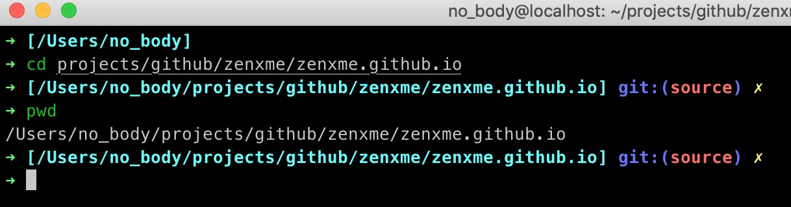

对oh my zsh prompt样式的修改方法。

<!-- more -->

oh my zsh的主题默认在`~/.oh-my-zsh/themes/`下面，如果对某个主题的样式不满意的话可以对该主题文件进行编辑。

比如我用的这个robbyrussell主题，它默认只显示当前文件夹名，而不是整个路径，这有时候会让人分不清所在的具体路径，于是可以进行如下的命令：

```bash
subl ~/.oh-my-zsh/themes/robbyrussell.zsh-theme
```

其中，subl即sublime text的启动程序。

打开之后只需对其中的`PROMPT`变量进行修改即可。

可以看到原来`%{$fg[cyan]%}%c%{$reset_color%}`中的`%c`，它是当前文件夹名的意思，这里可以修改为`[$PWD]`，表示完整路径。这部分文本最终变成了`{$fg[cyan]%}[$PWD]%{$reset_color%}`。

接着我测试之后发现，如果某个完整太长的话会占据整个terminal的一行，新输入的命令往往有一部分要拐到下一行，很不方便观看。

于是我在搜索之后发现可以用`$'\n'`引用换行符来添加到`PROMPT`的末尾，最终修改结果如下：

```bash
NEWLINE=$'\n'
PRE_PROMPT="%(?:%{$fg_bold[green]%}➜ :%{$fg_bold[red]%}➜ )"
PROMPT=$PRE_PROMPT
PROMPT+='%{$fg[cyan]%}[$PWD]%{$reset_color%} $(git_prompt_info)'
PROMPT+='${NEWLINE}'
PROMPT+=$PRE_PROMPT
```



